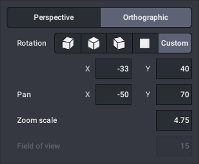

# BrickMMO LDR Directory

This repo is used as the IO/LDR/MPD CDN for BrickMMO realted IO/LDR/MPD models. Models are build using [BrickLink Studio](https://www.bricklink.com/v3/studio/download.page).

When rendering [Bricklink Studio](https://bricklink.com) models use the following co-ordinates:

---

## Project Stack

This project uses vanilla [Markdown](https://www.markdownguide.org/).

---

## Repo Resources

* [BrickMMO](https://www.brickmmo.com/)
* [BrickMMO LDR Directoy](https://ldr.brickmmo.com/)
* [LDR Viewer](https://pages.codeadam.ca/ldr-viewer/)

